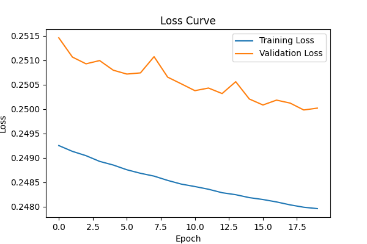
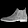
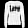

# Autoencoder Image Reconstruction Project

Proyek ini merupakan implementasi autoencoder sederhana menggunakan dataset Fashion MNIST, di mana input dan output berupa citra grayscale 28x28.

## 📁 Dataset
Dataset yang digunakan: **Fashion MNIST** (dari `tensorflow.keras.datasets`)
- Jumlah data latih: 60.000
- Jumlah data uji: 10.000
- Ukuran gambar: 28x28 piksel
- Format: Grayscale

## 🧠 Arsitektur Autoencoder
Model autoencoder menggunakan layer konvolusional dan transpos-konvolusional:
- Encoder:
  - Conv2D(32, 3x3, ReLU)
  - MaxPooling2D(2x2)
  - Conv2D(64, 3x3, ReLU)
  - MaxPooling2D(2x2)
- Decoder:
  - Conv2DTranspose(64, 3x3, ReLU)
  - UpSampling2D(2x2)
  - Conv2DTranspose(32, 3x3, ReLU)
  - UpSampling2D(2x2)
  - Conv2DTranspose(1, 3x3, Sigmoid)

## 📉 Performa Model (Loss Curve)
Grafik loss selama 10 epoch training:

## Hasil Rekonstruksi
Berikut adalah hasil input dan output autoencoder yang telah direkonstruksi:

### Gambar 1
**Input:**

**Output (Rekonstruksi):**

### Gambar 2
**Input:**

**Output (Rekonstruksi):**

### Gambar 3
**Input:**

**Output (Rekonstruksi):**

